# Udemy - Matlab Simulink Bible
Build 10 Practical Projects and go from Beginner to Pro in Simulink with this Project-Based Simulink Course!


## PROJECT #1: GENERATE, DISPLAY AND EXPORT SOURCE GENERATING SINE WAVE
### Used libraries
- Sinks → Scope (for data display)
- Sinks → Export to Workspace
  - Ezzel meglehet hívni az eredményt Matlabból, használható M script-ben, pl. `plot(out.Sum_OUT)`
- Sources → Sine Wave
  - Amplitude
  - Bias - for shifting up/down
  - Frequency (rad/sec)
- Commonly used blocks → Sum
  - List of signs: +++
### Notes
- Copying elements with right click, drag & drop
- If the signal is not smooth enough, not capturing all the data
  - Simulation → Model Configuration Parameters → Solver → Max step size: ~~auto~~ 0.01 sec
    - It takes a sample every 0.01 sec, means higher resolution signal

##  PROJECT #2: BUILD A MATHEMATICAL EQUATION (DIFFERENTIATION/INTEGRATION) SYSTEM
### Used libraries
- Sinks → Scope (for data display)
- Souces → Constant
- Sources → Ramp (increasing function)
- Continuous → Derivative
  - If I take a ramp, and differentiate it, the result will be a constant
- Commonly used blocks → Integrator
  - whatever signal is going in, it sums up over a specific period of time


## PROJECT #3: SIMULATE A MASS SPRING DAMPER SYSTEM IN TIME DOMAIN
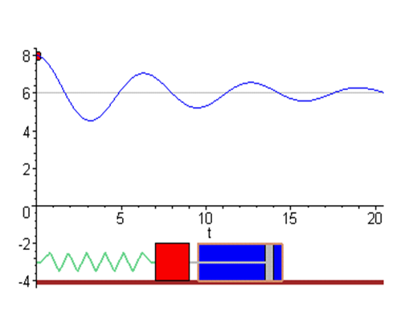
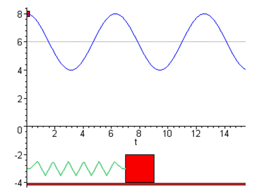
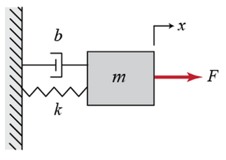
- `F`: Force
- `x`: position
- `m`: mass [kg]
- `b`: damping coefficient [Ns/m]
- `k`: (spring) stiffness coefficient


### Másodrendű differenciálegyenlet értelmezése

Az egyenlet: `M * x'' = F - b * x' - k * x`

Ez az egyenlet egy másodrendű lineáris differenciálegyenlet, amely egy rezgő mozgást vagy oszcillációt ír le, például egy csillapított harmonikus rezgést
- **M**: A rendszer tömege (kg).
- **x**: A kitérés az egyensúlyi helyzetből (m).
- **x'**: Az első időderivált, vagyis a sebesség (m/s).
- **x''**: A második időderivált, vagyis a gyorsulás (m/s²).
- **F**: A külső erő, ami hat a rendszerre (N).
- **b**: A csillapítási tényező (kg/s).
- **k**: A rugóállandó (N/m).

#### Fizikai jelentés
Ez a másodrendű differenciálegyenlet egy **rezgő rendszer** viselkedését írja le, ahol:
- A **tehetetlenség**: `M * x''` Ez a tag a test tehetetlenségéhez kapcsolódik, ahol 
`M` a test tömege, és `x¨` a gyorsulás. Ez a mozgást létrehozó erőhöz kötődik a Newton II. törvénye szerint (`F=ma`).
- A **csillapítási erő**: `-b * x'` Ez a csillapítási tag. A `b` a csillapítási együttható, `x˙`
  pedig a sebesség. Ez a tag az energia elvesztéséhez kapcsolódik, például súrlódás vagy légellenállás miatt. A csillapítás mindig az ellenkező irányban hat, mint a sebesség.
- A **rugóerő**: `-k * x`: Ez a rugóerő, amely az egyensúlyi helyzet felé hat. A `k` a rugóállandó, 
`x` pedig az elmozdulás. Ez a Hooke-törvény alapján működik `(F=−kx)`.

#### Dinamikai viselkedés
- **Kritikusan csillapított**: A rendszer gyorsan visszatér az egyensúlyba anélkül, hogy lengéseket végezne.
- **Alulcsillapított**: A rendszer leng, mielőtt megáll.
- **Túlcsillapított**: A rendszer lassan tér vissza egyensúlyba lengés nélkül.

#### Példák felhasználásra
Ez az egyenlet például használható:
- Mechanikai rendszerek modellezésére (pl. autók lengéscsillapítói).
- Elektromos áramkörök rezgéseinek leírására.
- Épületek szeizmikus rezgéseinek vizsgálatára.

#### Értelmezés
Ez az egyenlet egy csillapított harmonikus oszcillátorra jellemző, ahol a mozgást a rugóerő (\(kx\)) és a csillapítás (\(b\dot{x}\)) ellen dolgozva egy külső erő (\(F\)) hozza létre vagy tart fenn.

- **Ha nincs csillapítás (\(b = 0\)):** akkor egy egyszerű harmonikus oszcillációt kapunk.
- **Ha nincs külső erő (\(F = 0\)):** a rendszer szabadcsillapított rezgést végez.
- **Ha \(F\) időben változó:** például szinuszos, akkor a rendszer kényszerrezgéseket végezhet.

### Notes
- Acceleration → (integrate) → Velocity → (integrate) → position
```M script
b = 10;
k = 20;
F = 1;
M = 1;

sim("Project3.slx")
```

### Simulink Model
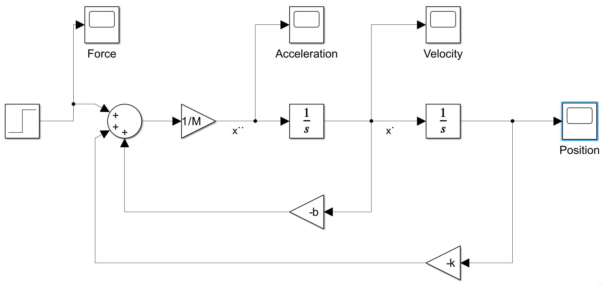

## PROJECT #4: Simulate a mass spring damper systen in S-Domain using Simulink
### Az egyenlet Laplace-transzformációval

Az eredeti egyenlet: `M * x'' = F - b * x' - k * x`

### Az egyenlet Laplace-tartományban:
Az egyenlet az `s`-tartományban: `M * (s^2 * X(s) - s * x(0) - x'(0)) = F(s) - b * (s * X(s) - x(0)) - k * X(s)`


### Végső forma:
`X(s) = [F(s) + M * s * x(0) + M * x'(0) - b * x(0)] / (M * s^2 + b * s + k)`


### Magyarázat:
- Az egyenlet Laplace-tartománybeli megoldása `X(s)` az `x(t)` időfüggvény transzformáltját adja meg.
- Az `s`-térbeli nevező (`M * s^2 + b * s + k`) a rendszer dinamikai viselkedését írja le.
- Az inverz Laplace-transzformációval vissza lehet térni az időtartományba (`x(t)`).

Ez az eljárás különösen hasznos differenciálegyenletek megoldására és rendszerek analízisére.

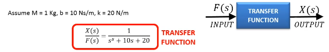

### Notes
#### M-script:
```M script
M = 1;
b = 0.1;
k = 10;
F = 10;
sim("Project4_Trial.slx")
```

### Simulink Model
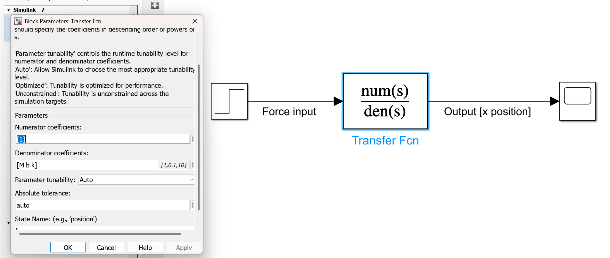

## PROJECT #5 BUILD AND SIMULATE A BATTERY MODEL
### Goal
- model a battery cell
- deal with Excel in Simulink
- add a lookup table in Simulink
- implementing an if condition or selector
- model a simple electrical circuit
- plot data in M-script command

### Open Circuit Voltage
Voltage of the battery of no load (no resistance)

### Closed loop, circuit voltage, terminal voltage
When there is load

### Notes
The battery SOC can be calculated using a technique known as coulomb counting or current integration. Let’s look at a simple example, Assume battery capacity is 25 Ah and assume a fully discharged cell. If we charge the battery at 2𝐴 current for 4 hours, the total accumulated Amp hours will add to: 2A*4h = 8Ah.
Therefore, the Battery State of charge the end of charging cycle using Coulomb-Counting is 32%:

**State of Charge (SOC)**  

$$
\text{SOC} = \frac{\text{Total Charge Input}}{\text{Maximum Cell Capacity}}
$$

Substituting the given values:  

$$
\text{SOC} = \frac{8 \, \text{Ah}}{25 \, \text{Ah}}
$$

Simplifying:  

$$
\text{SOC} = 0.32 \, \text{or} \, 32\%
$$

Nehezebb tölteni mint lemeríteni.

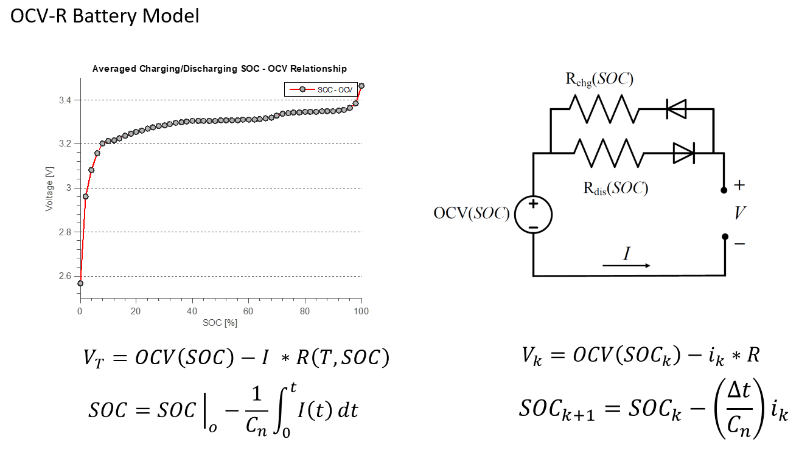

### Simulink Model
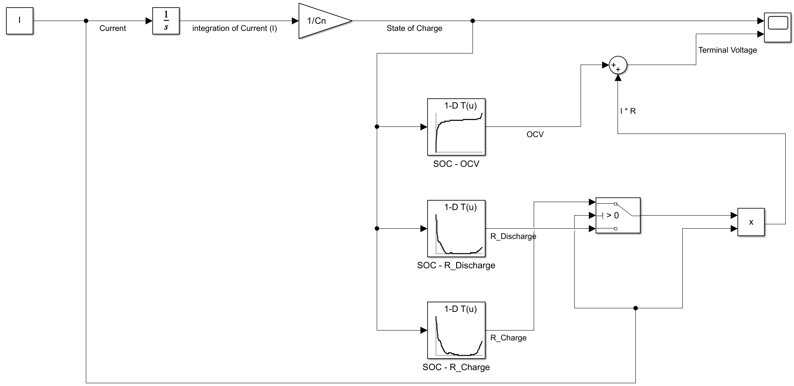

### M-script
```M script
%% Load Data
Data = xlsread("Battery_Parameters.xlsx");

%% Name the data
SOC = Data(:,1);
OCV = Data(:,2);
R_Charge = Data(:,3);
R_Discharge = Data(:,4);

%% Plot Data
plot(SOC, OCV);
figure
plot(SOC, R_Charge);
figure
plot(SOC, R_Discharge);

%% Simulate
I = 2.3 % Current [A]
Cn = 2.3 * 3600 % Capacity [A/s]
Sim_Time = 3600;
sim("Project5.slx")
```
# PROJECT #6 BUILD PROPORTIONAL INTEGRAL DERIVITIVE (PID) CONTROLLER IN SIMULINK
## What is a control system?
- Control is the process of causing a variable to behave to some desired way over time.
- Control variable example: temperature, altitude, speed, concentration

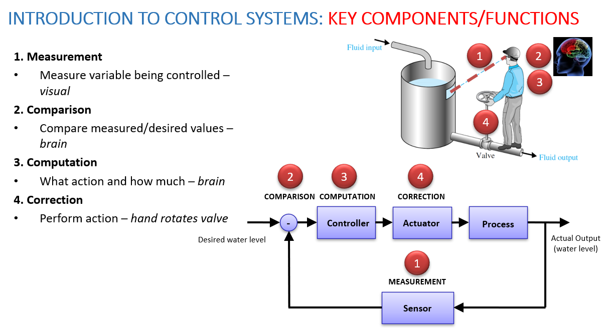
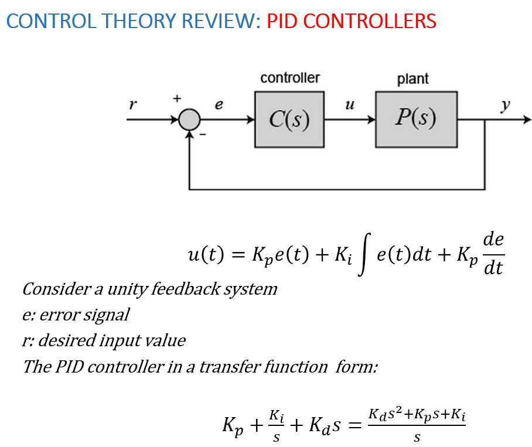
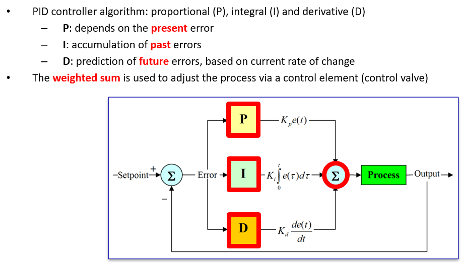

# PROJECT #9 DEVELOP AND SIMULATE ADAPTIVE CRUISE CONTROL SYSTEM
[Block Diagram Simplification - Process Control](https://msubbu.in/sp/ctrl/)

## M script
```M script
m = 1000;
b = 50;
r = 10; % step input value

s = tf('s'); % transfer function
Plant_TF = 1/(m*s + b);

Kp = 1000; % proportional element
Controller = pid(Kp);

TF_ClosedLoop = feedback(Controller*Plant_TF,1);

%% use Kp equal to 100 and a reference speed of 10m/s
t = 0:0.1:20;
step(r*TF_ClosedLoop,t)
axis([0 20 0 10]) % first two parameters:x | second two parameters: y

%% PID Controller
Kp = 800;
Ki = 40;
Controller = pid(Kp, Ki);

TF_ClosedLoop = feedback(Controller*Plant_TF,1);

step(r*T,t)
axis([0 20 0 10])
```

# PROJECT #10: DC MOTOR POSITION CONTROL IN SIMULINK
## DC MOTOR THEORY OF OPERATION
- A motor is an electrical machine which converts electrical energy into mechanical energy. 
- Take a wire and put it between the poles of a powerful, permanent horseshoe magnet. 
- Connect the two ends of the wire to a battery, the wire will move briefly. 
- When current pass through, it creates a magnetic field around it. 
- If we place the wire near a magnet, this magnetic field interacts with the permanent magnet's field. 
- It’s like putting two magnets near one another, they will repel or attract. 
- In the same way, the temporary magnetism around the wire attracts or repels the permanent magnetism from the magnet, and that's what causes the wire to move.
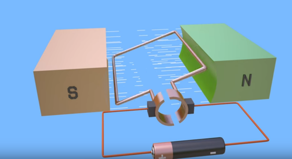
## DC MOTOR THEORY OF OPERATION
- The principle of working of a DC motor is that "whenever a current carrying conductor is placed in a magnetic field, it experiences a mechanical force". 
- Magnetic field may be provided by field winding (electromagnetism) or by using permanent magnets. 


## **1. Bevezetés a modellbe**
A bemenet és kimenet:
- **Bemenet (Input):** A motor **armatúrájára (rotorra) kapcsolt feszültség** (*V*).
- **Kimenet (Output):** A motor **tengelyének szöghelyzete** (*θ*), ami a motor forgásának állapotát adja meg.


## **2. A motor fizikai paraméterei**
Ezek a paraméterek határozzák meg, hogy a motor hogyan reagál a bemeneti feszültségre:

1. **J (tehetetlenségi nyomaték) = 3.2284E-6 kg.m²**  
   - A rotor tehetetlensége, azaz mennyire nehéz elindítani vagy megállítani a forgását.
   
2. **b (viszkózus súrlódási együttható) = 3.5077E-6 Nms**  
   - A tengely forgásával szembeni ellenállás (viszkózus súrlódás miatt).

3. **Ke (elektromotoros erő állandó) = 0.0274 V/rad/s**  
   - Az armatúrában indukálódó feszültség nagysága a tengely forgási sebességétől függően.

4. **Kt (motor nyomatékállandó) = 0.0274 Nm/A**  
   - Megmutatja, hogy az áram milyen nyomatékot hoz létre a motor tengelyén.

5. **R (ellenállás) = 4 Ω**  
   - Az armatúra tekercselésének elektromos ellenállása.

6. **L (induktancia) = 2.75E-6 H**  
   - Az armatúra tekercselésének induktív viselkedése (ellenállás az áramváltozásokkal szemben).

## **3. A kapcsolási rajz magyarázata**
A jobb oldali ábrán az egyenáramú motor áramköri modelljét láthatjuk.

1. **Bal oldalon a feszültségforrás (V):**  
   - Ez biztosítja az elektromos energiát a motor működéséhez.

2. **R és L:**  
   - **R** az armatúra tekercselésének ellenállását képviseli.
   - **L** az armatúra tekercselésének induktanciáját jelöli.

3. **i (áram az áramkörben):**  
   - Az áram, amely a motor tekercsein áthaladva forgatónyomatékot hoz létre.

4. **e (ellenelektromotoros erő, azaz ellen-EMF):**  
   - A rotor mozgása miatt a tekercsben indukálódó feszültség. Ez fékezi az áram növekedését és egyensúlyt teremt a rendszerben.

5. **T (forgatónyomaték):**  
   - A motor a mágneses mező és az áram segítségével nyomatékot hoz létre.

6. **J (tehetetlenségi nyomaték) és b (súrlódás):**  
   - A rotor tömegéből és a tengely súrlódásából adódó ellenállások.

7. **θ (szögelfordulás) és θ̇ (szögsebesség):**  
   - A tengely forgási állapotát mutatják.


## **4. Hogyan működik a rendszer?**
1. **Bekapcsolás után a feszültség (V) áramot (i) hoz létre** az áramkörben az *R* és *L* ellenállásai figyelembevételével.
2. **Az áram nyomatékot (T) generál** a motorban a *Kt* állandóval.
3. **A nyomaték felgyorsítja a tengelyt**, amelynek mozgását *J* és *b* határozza meg.
4. **A mozgás miatt egy ellen-EMF (e) indukálódik**, amely a *Ke* állandóval csökkenti az áramot.
5. **Végül egy egyensúlyi sebesség alakul ki**, ahol a motor forgása beáll egy állandó értékre.


## **5. Összegzés**
Ez a modell egy **egyenáramú motor matematikai leírása**, amelyben az **elektromos és mechanikai komponensek** kölcsönhatásából következik a motor forgása. A cél az, hogy egy adott **bemeneti feszültség (V)** alapján meghatározzuk a tengely **szöghelyzetét (θ)**.

# **DC Motor Modell Matematikai Leírása**

## **1. Newton második törvénye alkalmazva a motor forgó részére**  
Newton második törvénye kimondja, hogy a forgó testek esetében:

$$
J \frac{d^2\theta}{dt^2} = T - b \frac{d\theta}{dt}
$$

**Jelölések:**
- \( J \) – A rotor **tehetetlenségi nyomatéka** (*kg·m²*)
- A szögelfordulás **második deriváltja az idő szerint** (*rad/s²*), azaz a szögszerinti gyorsulás:

  $$
  \frac{d^2\theta}{dt^2}
  $$

- \( T \) – A motor által kifejtett **nyomaték** (*Nm*)
- A tengelyen ható **viszkózus súrlódási nyomaték**:

  $$
  b \frac{d\theta}{dt}
  $$

  ahol:
  - \( b \) a **viszkózus súrlódási együttható** (*Nms*)
  - A tengely **szögsebessége** (*rad/s*):

    $$
    \frac{d\theta}{dt}
    $$


### **Nyomaték kifejezése az áram függvényében**
A motor forgatónyomatéka az armatúra áramától függ:

$$
T = K_t i
$$

Ahol:
- \( K_t \) – A motor **nyomatékállandója** (*Nm/A*)
- \( i \) – A motorban folyó **áram** (*A*)

Ezt behelyettesítve az eredeti egyenletbe:

$$
J \frac{d^2\theta}{dt^2} = K_t i - b \frac{d\theta}{dt}
$$

Majd az egyenletet \( J \)-re osztva:

$$
\frac{d^2\theta}{dt^2} = \frac{1}{J} \left( K_t i - b \frac{d\theta}{dt} \right)
$$

Ez a mozgásegyenlet leírja, hogy a motor tengelyének gyorsulása (\( \frac{d^2\theta}{dt^2} \)) hogyan függ az elektromos áramtól és a súrlódástól.

---

## **2. Kirchhoff törvénye az armatúra áramkörére**
A motor elektromos viselkedése Kirchhoff törvényével írható le:

$$
L \frac{di}{dt} = - R i + V - e
$$

**Jelölések:**
- \( L \) – Az armatúra **induktanciája** (*H*)
- Az **áram idő szerinti változása** (*A/s*):  

  $$
  \frac{di}{dt}
  $$

- \( R \) – Az armatúra **ellenállása** (*Ω*)
- \( V \) – Az **alkalmazott feszültség** (*V*)
- Az **ellen-EMF (ellenelektromotoros erő)** (*V*):  

  $$
  e
  $$


Az **ellen-EMF** a tengely szögsebességétől függ:

$$
e = K_e \frac{d\theta}{dt}
$$

Ahol:
- \( K_e \) – A motor **ellen-EMF állandója** (*V/rad/s*)
- A tengely **szögsebessége** (*rad/s*):  

  $$
  \frac{d\theta}{dt}
  $$


Ezt behelyettesítve Kirchhoff egyenletébe:

$$
L \frac{di}{dt} = - R i + V - K_e \frac{d\theta}{dt}
$$

Majd az egyenletet \( L \)-re osztva:

$$
\frac{di}{dt} = \frac{1}{L} \left( -R i + V - K_e \frac{d\theta}{dt} \right)
$$

Ez az egyenlet leírja, hogyan változik az armatúra **árama** az alkalmazott feszültség, az ellenállás, az ellen-EMF és az induktancia hatására.

---

## **3. Összegzés**
Ez a két egyenlet együtt **leírja a DC motor dinamikáját**:
1. **Newton második törvénye** → A motor mechanikai viselkedése (forgó mozgás).
2. **Kirchhoff törvénye** → A motor elektromos viselkedése (áramkör dinamikája).

A kettő összekapcsolása lehetővé teszi a motor **szimulációját és szabályozását** különböző bemeneti feszültségek esetén.

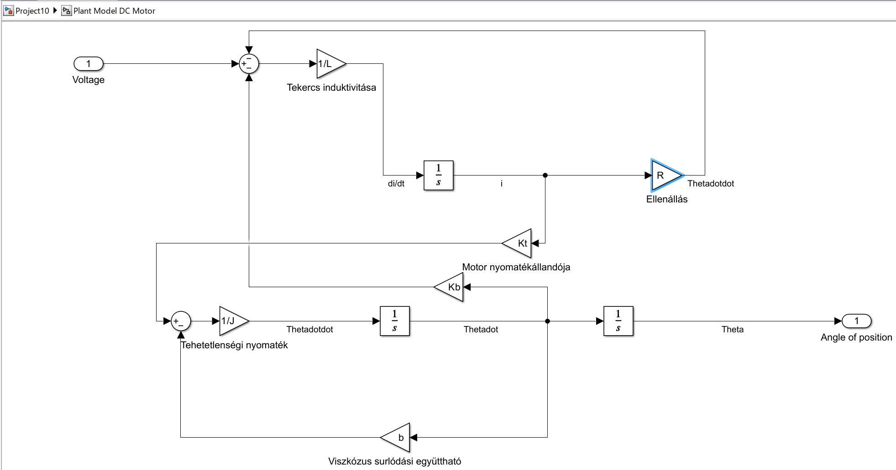

```M script
%% Simulate DC motor
V = 1;
J = 3.2284E-6; % kg.m˘2
b = 3.5077E-6; % Nms
Kb = 0.0274; % V/rad/sec
Kt = 0.0274; % Nm/Amp
R = 4; % Ohm
L = 2.75E-6; % H
sim('Project10');
```