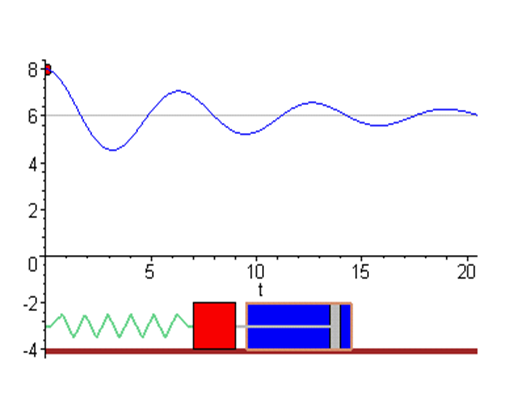
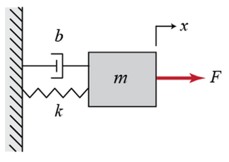
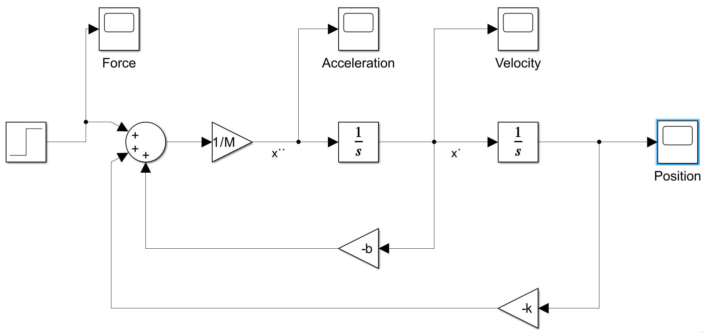
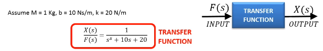

# Udemy - Matlab Simulink Bible
Build 10 Practical Projects and go from Beginner to Pro in Simulink with this Project-Based Simulink Course!


## PROJECT #1: Generate, Display and export soure generating sine wave
### Used libraries
- Sinks → Scope (for data display)
- Sinks → Export to Workspace
  - Ezzel meglehet hívni az eredményt Matlabból, használható M script-ben, pl. `plot(out.Sum_OUT)`
- Sources → Sine Wave
  - Amplitude
  - Bias - for shifting up/down
  - Frequency (rad/sec)
- Commonly used blocks → Sum
  - List of signs: +++
### Notes
- Copying elements with right click, drag & drop
- If the signal is not smooth enough, not capturing all the data
  - Simulation → Model Configuration Parameters → Solver → Max step size: ~~auto~~ 0.01 sec
    - It takes a sample every 0.01 sec, means higher resolution signal

## PROJECT #2: Build a mathematical equation (differentiation/integration) system
### Used libraries
- Sinks → Scope (for data display)
- Souces → Constant
- Sources → Ramp (increasing function)
- Continuous → Derivative
  - If I take a ramp, and differentiate it, the result will be a constant
- Commonly used blocks → Integrator
  - whatever signal is going in, it sums up over a specific period of time


## PROJECT #3: SIMULATE A MASS SPRING DAMPER SYSTEM IN TIME DOMAIN



- `F`: Force
- `x`: position
- `m`: mass [kg]
- `b`: damping coefficient [Ns/m]
- `k`: (spring) stiffness coefficient


### Másodrendű differenciálegyenlet értelmezése

Az egyenlet: `M * x'' = F - b * x' - k * x`

Ez az egyenlet egy másodrendű lineáris differenciálegyenlet, amely egy rezgő mozgást vagy oszcillációt ír le, például egy csillapított harmonikus rezgést
- **M**: A rendszer tömege (kg).
- **x**: A kitérés az egyensúlyi helyzetből (m).
- **x'**: Az első időderivált, vagyis a sebesség (m/s).
- **x''**: A második időderivált, vagyis a gyorsulás (m/s²).
- **F**: A külső erő, ami hat a rendszerre (N).
- **b**: A csillapítási tényező (kg/s).
- **k**: A rugóállandó (N/m).

#### Fizikai jelentés
Ez a másodrendű differenciálegyenlet egy **rezgő rendszer** viselkedését írja le, ahol:
- A **tehetetlenség**: `M * x''` Ez a tag a test tehetetlenségéhez kapcsolódik, ahol 
`M` a test tömege, és `x¨` a gyorsulás. Ez a mozgást létrehozó erőhöz kötődik a Newton II. törvénye szerint (`F=ma`).
- A **csillapítási erő**: `-b * x'` Ez a csillapítási tag. A `b` a csillapítási együttható, `x˙`
  pedig a sebesség. Ez a tag az energia elvesztéséhez kapcsolódik, például súrlódás vagy légellenállás miatt. A csillapítás mindig az ellenkező irányban hat, mint a sebesség.
- A **rugóerő**: `-k * x`: Ez a rugóerő, amely az egyensúlyi helyzet felé hat. A `k` a rugóállandó, 
`x` pedig az elmozdulás. Ez a Hooke-törvény alapján működik `(F=−kx)`.

#### Dinamikai viselkedés
- **Kritikusan csillapított**: A rendszer gyorsan visszatér az egyensúlyba anélkül, hogy lengéseket végezne.
- **Alulcsillapított**: A rendszer leng, mielőtt megáll.
- **Túlcsillapított**: A rendszer lassan tér vissza egyensúlyba lengés nélkül.

#### Példák felhasználásra
Ez az egyenlet például használható:
- Mechanikai rendszerek modellezésére (pl. autók lengéscsillapítói).
- Elektromos áramkörök rezgéseinek leírására.
- Épületek szeizmikus rezgéseinek vizsgálatára.

#### Értelmezés
Ez az egyenlet egy csillapított harmonikus oszcillátorra jellemző, ahol a mozgást a rugóerő (\(kx\)) és a csillapítás (\(b\dot{x}\)) ellen dolgozva egy külső erő (\(F\)) hozza létre vagy tart fenn.

- **Ha nincs csillapítás (\(b = 0\)):** akkor egy egyszerű harmonikus oszcillációt kapunk.
- **Ha nincs külső erő (\(F = 0\)):** a rendszer szabadcsillapított rezgést végez.
- **Ha \(F\) időben változó:** például szinuszos, akkor a rendszer kényszerrezgéseket végezhet.

### Notes
- Acceleration → (integrate) → Velocity → (integrate) → position
```M script
b = 10;
k = 20;
F = 1;
M = 1;

sim("Project3.slx")
```

### Simulink Model


## PROJECT #4: Simulate a mass spring damper systen in S-Domain using Simulink
### Az egyenlet Laplace-transzformációval

Az eredeti egyenlet: `M * x'' = F - b * x' - k * x`

### Az egyenlet Laplace-tartományban:
Az egyenlet az `s`-tartományban: `M * (s^2 * X(s) - s * x(0) - x'(0)) = F(s) - b * (s * X(s) - x(0)) - k * X(s)`


### Végső forma:
`X(s) = [F(s) + M * s * x(0) + M * x'(0) - b * x(0)] / (M * s^2 + b * s + k)`


### Magyarázat:
- Az egyenlet Laplace-tartománybeli megoldása `X(s)` az `x(t)` időfüggvény transzformáltját adja meg.
- Az `s`-térbeli nevező (`M * s^2 + b * s + k`) a rendszer dinamikai viselkedését írja le.
- Az inverz Laplace-transzformációval vissza lehet térni az időtartományba (`x(t)`).

Ez az eljárás különösen hasznos differenciálegyenletek megoldására és rendszerek analízisére.



### Notes
#### M-script:
```M script
M = 1;
b = 0.1;
k = 10;
F = 10;
sim("Project4_Trial.slx")
```

### Simulin Model


